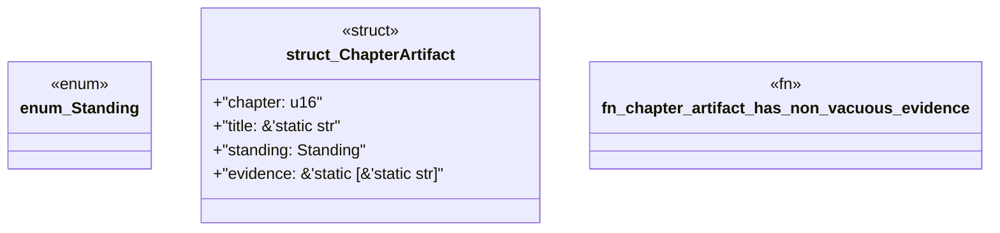

# `book/src/listings/207-207-engine-error-codes.rs`

Source SHA-256: `5e6ee442eff68a708e17b7ad2607a9d32af9f96b2be362f521b540cb1535b410`

## Dependencies

- None observed.

## Standing

- Structural parse: `ALIVE`
- Runtime behavior: `UNKNOWN`
