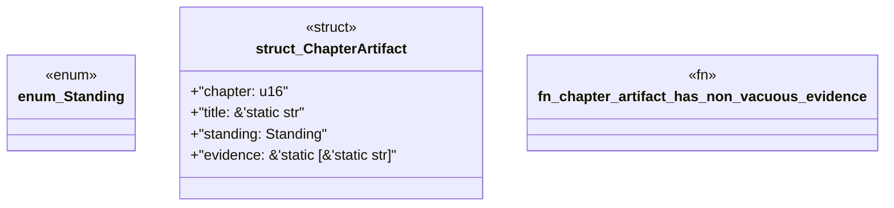

# `book/src/listings/208-208-fm-pack-012-and-fm-pack-013.rs`

Source SHA-256: `0ebe257cc59ef0e5ab39040a65be0dc9659faab50ddfccee0a51a9a13d5896d3`

## Dependencies

- None observed.

## Standing

- Structural parse: `ALIVE`
- Runtime behavior: `UNKNOWN`
