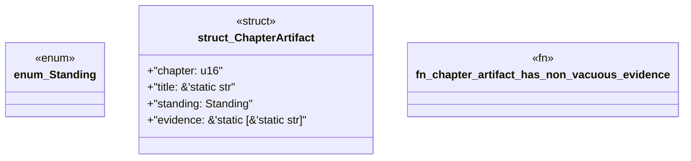

# `book/src/listings/209-209-fm-write-005-and-fm-write-008.rs`

Source SHA-256: `45c2da751feb36e3cd285db19d8cedd1cca61e7ef55e04985db81a491fbe551c`

## Dependencies

- None observed.

## Standing

- Structural parse: `ALIVE`
- Runtime behavior: `UNKNOWN`
