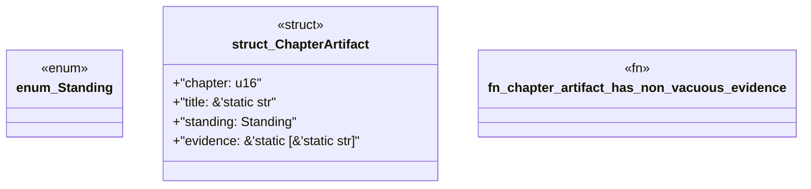

# `book/src/listings/210-210-no-engine-change-when-pack-law-is-enough.rs`

Source SHA-256: `5746a33c98e5ce7c778a47c789225b3774dfee453134e67b9dcb99761baef512`

## Dependencies

- None observed.

## Standing

- Structural parse: `ALIVE`
- Runtime behavior: `UNKNOWN`
