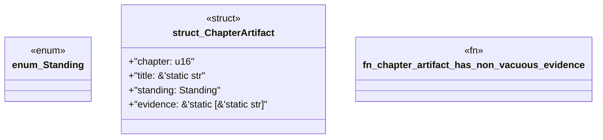

# `book/src/listings/211-211-when-engine-work-is-unavoidable.rs`

Source SHA-256: `b045e260dc36508ce94c493e9a853541014feaeaaf0d9ab899eb92616412676a`

## Dependencies

- None observed.

## Standing

- Structural parse: `ALIVE`
- Runtime behavior: `UNKNOWN`
