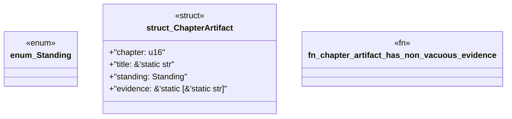

# `book/src/listings/212-212-prove-the-engine-change-against-multiple-packs.rs`

Source SHA-256: `eb8e86dabc5dae4b25de5989c77332760dfa6acf353b9d10924804ba17a9979c`

## Dependencies

- None observed.

## Standing

- Structural parse: `ALIVE`
- Runtime behavior: `UNKNOWN`
