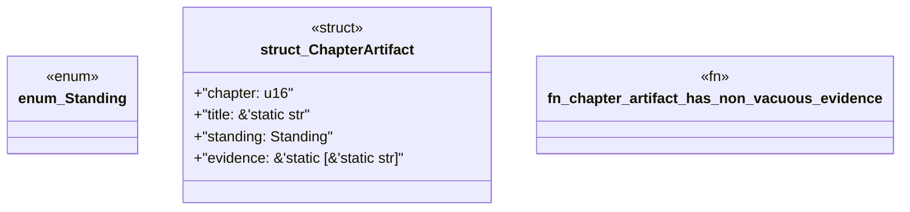

# `book/src/listings/213-213-write-the-ard-and-prd.rs`

Source SHA-256: `43f20c74fae7afb9cb05dbba35eedb35a385c91bf50c54e859b61ae16171fc0a`

## Dependencies

- None observed.

## Standing

- Structural parse: `ALIVE`
- Runtime behavior: `UNKNOWN`
