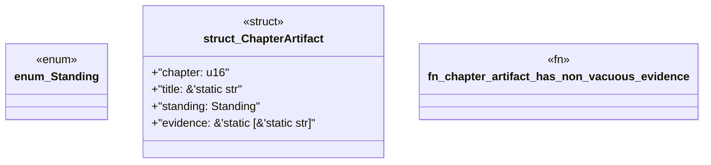

# `book/src/listings/214-214-define-the-complete-product-surface.rs`

Source SHA-256: `5e2d3efac84318975d96946116f31284a44743bfc950ae23d2d374875ce9fcd0`

## Dependencies

- None observed.

## Standing

- Structural parse: `ALIVE`
- Runtime behavior: `UNKNOWN`
