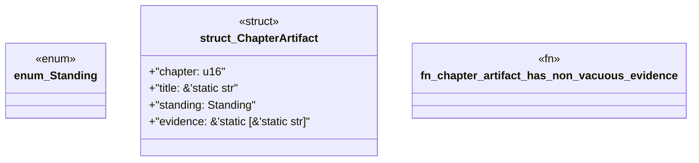

# `book/src/listings/217-217-name-every-acceptance-artifact.rs`

Source SHA-256: `e84f4d6a331e1a494e8c6dad0bedabcab0d014df842f83f984311d24431edef1`

## Dependencies

- None observed.

## Standing

- Structural parse: `ALIVE`
- Runtime behavior: `UNKNOWN`
