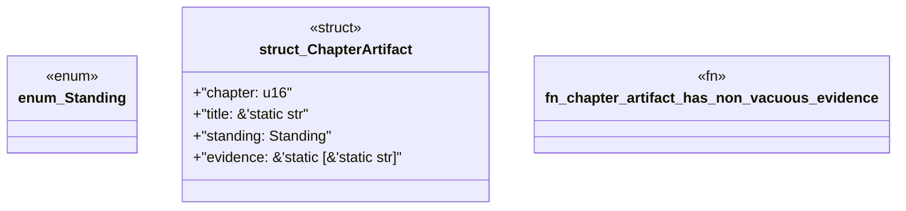

# `book/src/listings/218-218-define-the-reference-oracle.rs`

Source SHA-256: `2a26f6db30468ad4ec443222190c2d16b33b8adf9ba8a1f017a007df9711139c`

## Dependencies

- None observed.

## Standing

- Structural parse: `ALIVE`
- Runtime behavior: `UNKNOWN`
