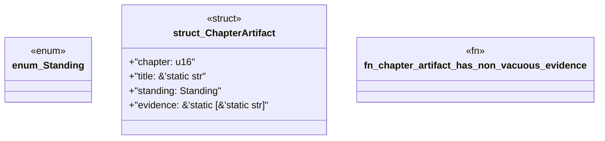

# `book/src/listings/219-219-define-the-consumer.rs`

Source SHA-256: `b0c4ab7f0420678e2bbc3bc0ee80b6a6010ce8140f35593ad0ccd52b5d8ecd32`

## Dependencies

- None observed.

## Standing

- Structural parse: `ALIVE`
- Runtime behavior: `UNKNOWN`
