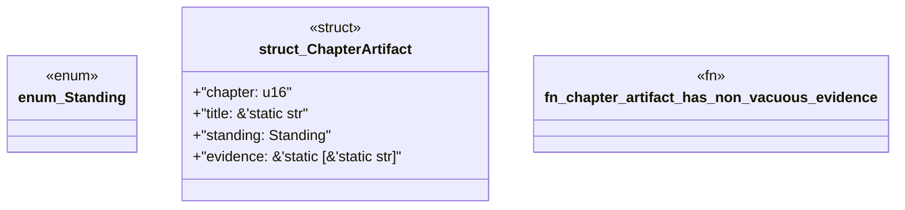

# `book/src/listings/220-220-define-the-proof-suite.rs`

Source SHA-256: `d8dc5b4b1d9823e2078585820996191bcb764436a2b3fa396a9cced003ffe7b8`

## Dependencies

- None observed.

## Standing

- Structural parse: `ALIVE`
- Runtime behavior: `UNKNOWN`
