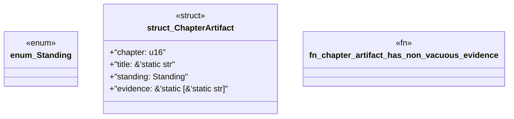

# `book/src/listings/223-223-define-the-release-surface.rs`

Source SHA-256: `1523e0b68de5add0cbe6875194d11f5c6895190769bb06b86f7fd66574420690`

## Dependencies

- None observed.

## Standing

- Structural parse: `ALIVE`
- Runtime behavior: `UNKNOWN`
