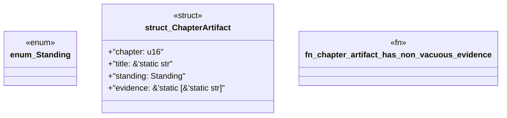

# `book/src/listings/224-224-define-the-level-five-definition-of-done.rs`

Source SHA-256: `a5e2c1c50dcc164b4865222436841b9077c7b65db50490603574f78ad1bad78e`

## Dependencies

- None observed.

## Standing

- Structural parse: `ALIVE`
- Runtime behavior: `UNKNOWN`
