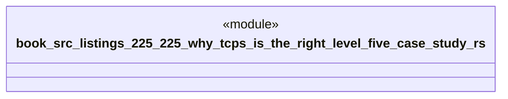

# `book/src/listings/225-225-why-tcps-is-the-right-level-five-case-study.rs`

Source SHA-256: `f8052ea4e453829c7fe5ae86b10f780940399f28a5a12486b5a32a441d7544b8`

## Dependencies

- None observed.

## Standing

- Structural parse: `ALIVE`
- Runtime behavior: `UNKNOWN`
