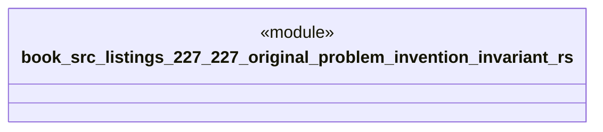

# `book/src/listings/227-227-original-problem-invention-invariant.rs`

Source SHA-256: `6c2e1a2b4cc3e7adcdfc0c11b3aa9eb02ebd38794fce489ad2015ea6e1668e43`

## Dependencies

- None observed.

## Standing

- Structural parse: `ALIVE`
- Runtime behavior: `UNKNOWN`
