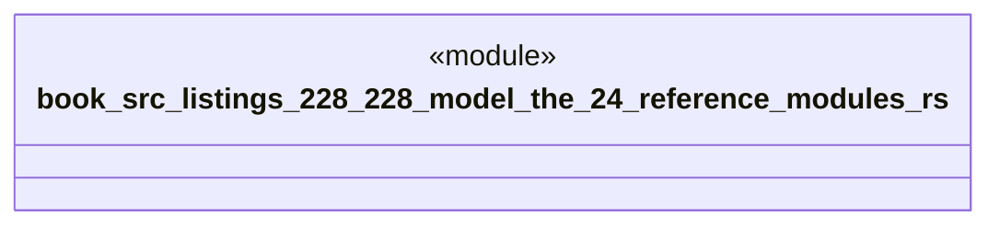

# `book/src/listings/228-228-model-the-24-reference-modules.rs`

Source SHA-256: `8bed700364be9fb5ce3c1675135bbbf0282626d2a7b228456a53112c5d5657c1`

## Dependencies

- None observed.

## Standing

- Structural parse: `ALIVE`
- Runtime behavior: `UNKNOWN`
