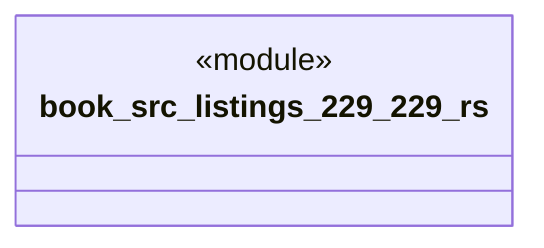

# `book/src/listings/229-229.rs`

Source SHA-256: `ea6e0b699b2752e03e4155ef1ac3721a1f10a769ea4a4d206b8c66c9b27812fc`

## Dependencies

- None observed.

## Standing

- Structural parse: `ALIVE`
- Runtime behavior: `UNKNOWN`
