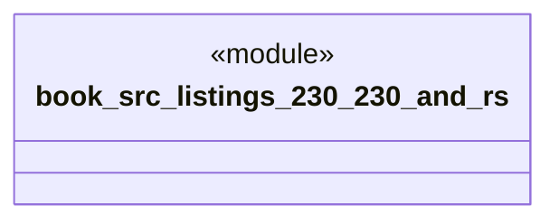

# `book/src/listings/230-230-and.rs`

Source SHA-256: `d6eb70bb7f518243759a7f753d02b67d0b4d5fef5c136e6cf3041564e4033de9`

## Dependencies

- None observed.

## Standing

- Structural parse: `ALIVE`
- Runtime behavior: `UNKNOWN`
