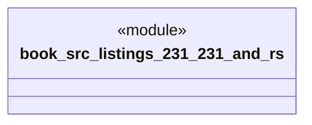

# `book/src/listings/231-231-and.rs`

Source SHA-256: `f352eef05ab00906c1ec3092a0200bd666e4250e7881894df5d56847d3cddce9`

## Dependencies

- None observed.

## Standing

- Structural parse: `ALIVE`
- Runtime behavior: `UNKNOWN`
