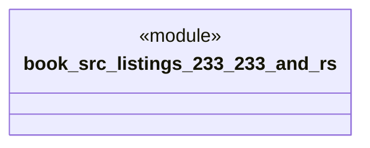

# `book/src/listings/233-233-and.rs`

Source SHA-256: `ddd1ecfaec23493b64293dee2be5a6751326021ff6f9079637d9a2c6526a923a`

## Dependencies

- None observed.

## Standing

- Structural parse: `ALIVE`
- Runtime behavior: `UNKNOWN`
