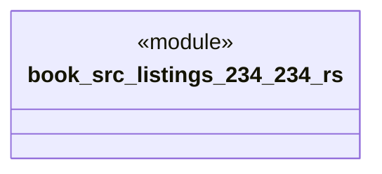

# `book/src/listings/234-234.rs`

Source SHA-256: `82877218b2f478dfdaec88eb5c035ecd24a0f7aab090c24dd4a6b93be45ad4bb`

## Dependencies

- None observed.

## Standing

- Structural parse: `ALIVE`
- Runtime behavior: `UNKNOWN`
