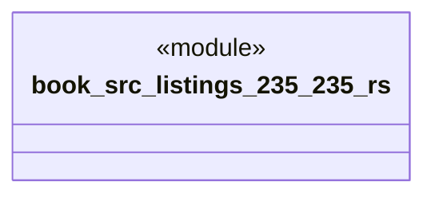

# `book/src/listings/235-235.rs`

Source SHA-256: `4b5e29bc9cbdfd0920829bbc017ef683ad77198f1987420970a867954a2e8d02`

## Dependencies

- None observed.

## Standing

- Structural parse: `ALIVE`
- Runtime behavior: `UNKNOWN`
