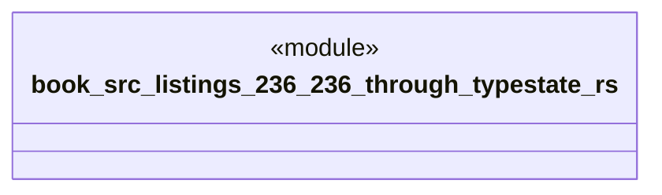

# `book/src/listings/236-236-through-typestate.rs`

Source SHA-256: `4435adcf48e3df6d875f1281e79da9ab882e1c598b1cab5689854a57ee33d51e`

## Dependencies

- None observed.

## Standing

- Structural parse: `ALIVE`
- Runtime behavior: `UNKNOWN`
