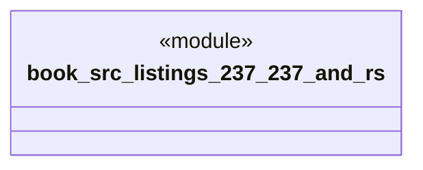

# `book/src/listings/237-237-and.rs`

Source SHA-256: `a9f29aae9358244f48a4ae8b5bf87df79f6e62b0f60f60b80cccd790d3c02b37`

## Dependencies

- None observed.

## Standing

- Structural parse: `ALIVE`
- Runtime behavior: `UNKNOWN`
