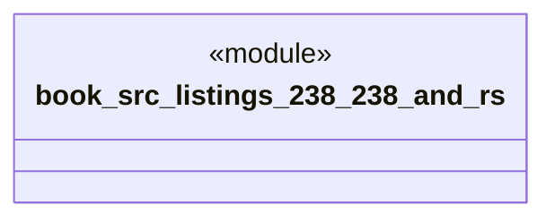

# `book/src/listings/238-238-and.rs`

Source SHA-256: `cbee499da4e85e38336ca5f84c6a8a5ff439cb502886e3f959c0ae5ffb333138`

## Dependencies

- None observed.

## Standing

- Structural parse: `ALIVE`
- Runtime behavior: `UNKNOWN`
