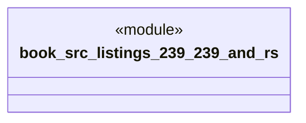

# `book/src/listings/239-239-and.rs`

Source SHA-256: `f9ede6fbfdcfc32b3c268820557e1311ff95d8aaba45d361e2caaa00e9990e6e`

## Dependencies

- None observed.

## Standing

- Structural parse: `ALIVE`
- Runtime behavior: `UNKNOWN`
