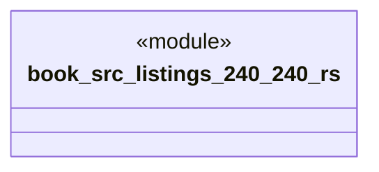

# `book/src/listings/240-240.rs`

Source SHA-256: `39b4234a69c0137d3534102b6d59d91c5dee99ce2cb1cb3d30d16af135ef2ff8`

## Dependencies

- None observed.

## Standing

- Structural parse: `ALIVE`
- Runtime behavior: `UNKNOWN`
