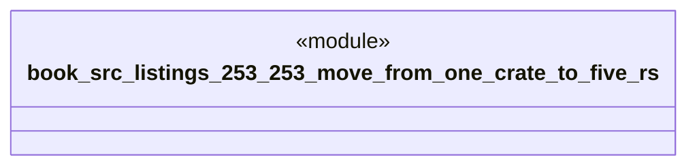

# `book/src/listings/253-253-move-from-one-crate-to-five.rs`

Source SHA-256: `130943b56043c3d836cfa1018e26d1a57d31110edb0857e5ee3869c963ded4ff`

## Dependencies

- None observed.

## Standing

- Structural parse: `ALIVE`
- Runtime behavior: `UNKNOWN`
