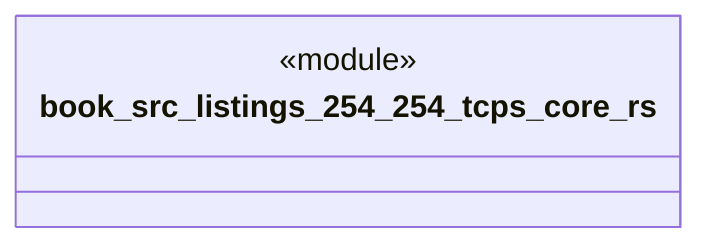

# `book/src/listings/254-254-tcps-core.rs`

Source SHA-256: `d1f09352ada481c17e199e8f193151e9dde888d9005c8fa851e6385a2cffe612`

## Dependencies

- None observed.

## Standing

- Structural parse: `ALIVE`
- Runtime behavior: `UNKNOWN`
