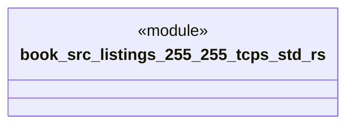

# `book/src/listings/255-255-tcps-std.rs`

Source SHA-256: `96f99287cf2dd203ce877eabdb5b310ae5525532fff718a38bdca1c9c0840356`

## Dependencies

- None observed.

## Standing

- Structural parse: `ALIVE`
- Runtime behavior: `UNKNOWN`
