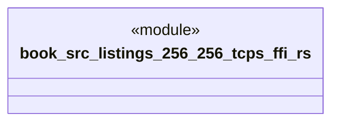

# `book/src/listings/256-256-tcps-ffi.rs`

Source SHA-256: `51d9ed12b5232a9e3ff97bf0b1365e2b9997ad8872d282517a942a31252388a0`

## Dependencies

- None observed.

## Standing

- Structural parse: `ALIVE`
- Runtime behavior: `UNKNOWN`
