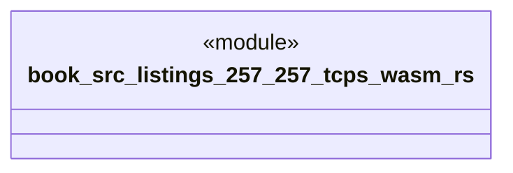

# `book/src/listings/257-257-tcps-wasm.rs`

Source SHA-256: `a36860bcf1cbc9e18a734f111c3b7a8144185aba754f040f95adf27f36bcb474`

## Dependencies

- None observed.

## Standing

- Structural parse: `ALIVE`
- Runtime behavior: `UNKNOWN`
