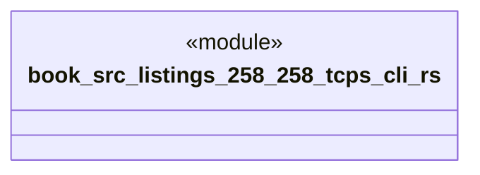

# `book/src/listings/258-258-tcps-cli.rs`

Source SHA-256: `6161df189a6ccd748ac3b3973b045eabd1b7185bc333d12b4221a3b5eb1743e0`

## Dependencies

- None observed.

## Standing

- Structural parse: `ALIVE`
- Runtime behavior: `UNKNOWN`
