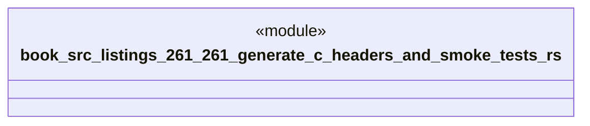

# `book/src/listings/261-261-generate-c-headers-and-smoke-tests.rs`

Source SHA-256: `85d4ac5579618f5b2909d1203cc4db7992a0e7c7f2382106002c31363b2fe4ea`

## Dependencies

- None observed.

## Standing

- Structural parse: `ALIVE`
- Runtime behavior: `UNKNOWN`
