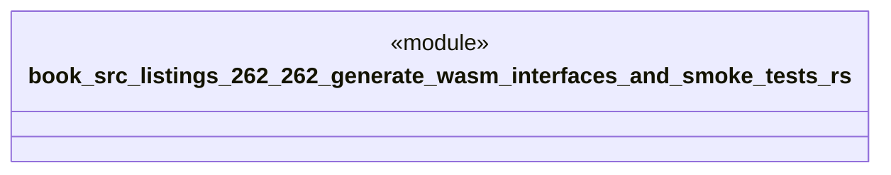

# `book/src/listings/262-262-generate-wasm-interfaces-and-smoke-tests.rs`

Source SHA-256: `387ff82cfd7847962c6b61deeafeb26008e45267b9ac2ca1b5da7b12847566ba`

## Dependencies

- None observed.

## Standing

- Structural parse: `ALIVE`
- Runtime behavior: `UNKNOWN`
