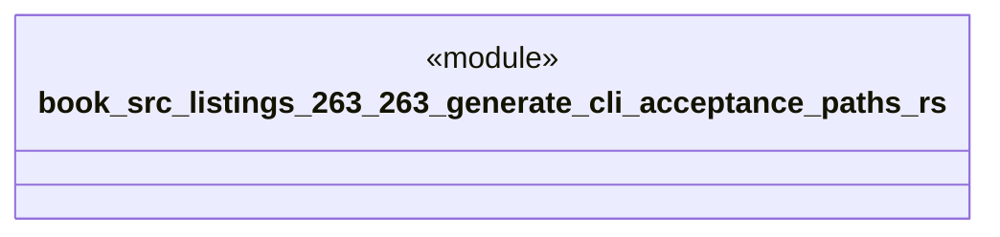

# `book/src/listings/263-263-generate-cli-acceptance-paths.rs`

Source SHA-256: `106e07d4cfc8b963b640366a58df4ebb0553f5590b3cf6c183d177e81d5447ab`

## Dependencies

- None observed.

## Standing

- Structural parse: `ALIVE`
- Runtime behavior: `UNKNOWN`
