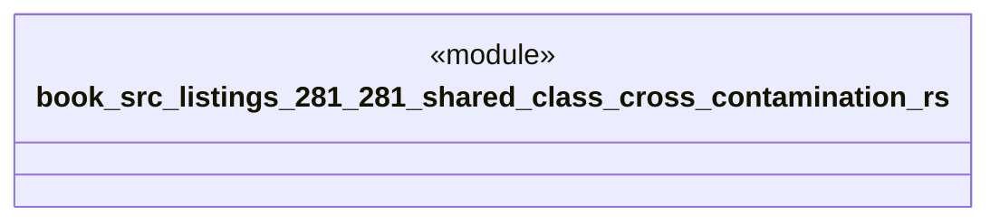

# `book/src/listings/281-281-shared-class-cross-contamination.rs`

Source SHA-256: `d9cc3254033009d91fb3dc6fb6ca3a9b801b106234ddfa07a06c0382eb3c4e78`

## Dependencies

- None observed.

## Standing

- Structural parse: `ALIVE`
- Runtime behavior: `UNKNOWN`
