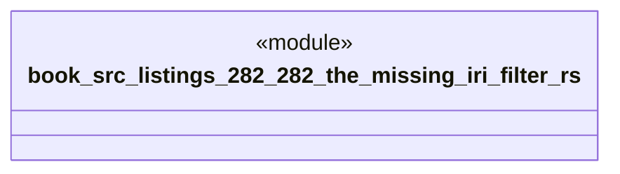

# `book/src/listings/282-282-the-missing-iri-filter.rs`

Source SHA-256: `dd688e65c5e929ea148e78b03c5903033be38599a6aa610dfb63285c1e24746e`

## Dependencies

- None observed.

## Standing

- Structural parse: `ALIVE`
- Runtime behavior: `UNKNOWN`
