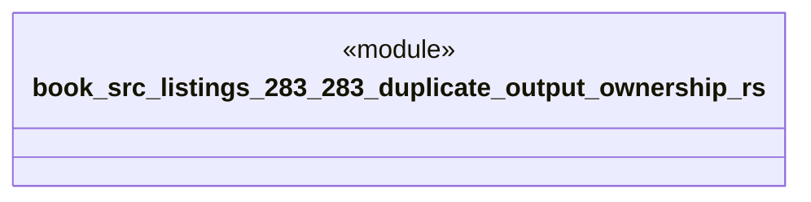

# `book/src/listings/283-283-duplicate-output-ownership.rs`

Source SHA-256: `d7cf1076325f78db06ce6dd678ed4c58a0d488be0bf75887d39359f247ac076e`

## Dependencies

- None observed.

## Standing

- Structural parse: `ALIVE`
- Runtime behavior: `UNKNOWN`
