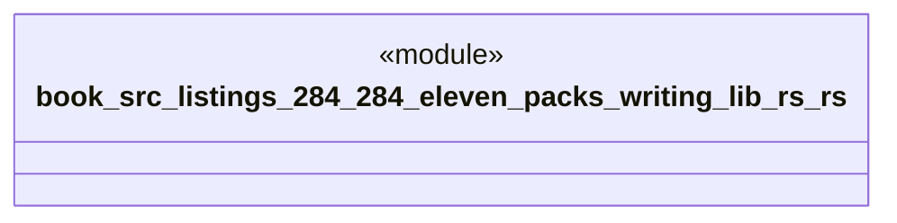

# `book/src/listings/284-284-eleven-packs-writing-lib-rs.rs`

Source SHA-256: `c81314f5a7898a2ef648edf151633568ea93570b121b20436024efce35efddb2`

## Dependencies

- None observed.

## Standing

- Structural parse: `ALIVE`
- Runtime behavior: `UNKNOWN`
