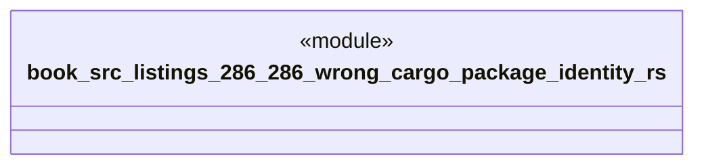

# `book/src/listings/286-286-wrong-cargo-package-identity.rs`

Source SHA-256: `f40ccec3c6ab7c08e616d9fbc8feb467c3eee8e986fcc050fc221215e6862a0e`

## Dependencies

- None observed.

## Standing

- Structural parse: `ALIVE`
- Runtime behavior: `UNKNOWN`
