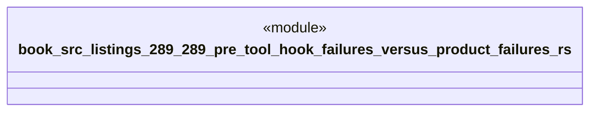

# `book/src/listings/289-289-pre-tool-hook-failures-versus-product-failures.rs`

Source SHA-256: `0f9396cf110455b97567afc34654db7a425dd8f5df9f37a3587c0b269a8656ae`

## Dependencies

- None observed.

## Standing

- Structural parse: `ALIVE`
- Runtime behavior: `UNKNOWN`
