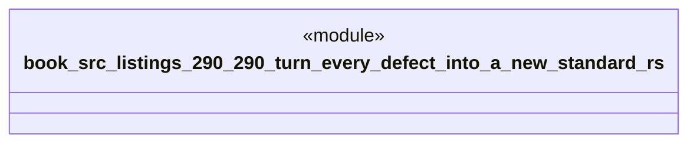

# `book/src/listings/290-290-turn-every-defect-into-a-new-standard.rs`

Source SHA-256: `cd5c332ba4673ca3bb7a20fb0fbecc0579c0b5657219c6d37a4cb3970492a348`

## Dependencies

- None observed.

## Standing

- Structural parse: `ALIVE`
- Runtime behavior: `UNKNOWN`
