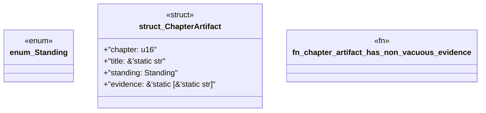

# `book/src/listings/appendix-A-appendix-a-canonical-pack-directory-layout.rs`

Source SHA-256: `d22be29f988898ea4d109beba8dc711e900d9cc45d7a5312f0af43c05080bfe2`

## Dependencies

- None observed.

## Standing

- Structural parse: `ALIVE`
- Runtime behavior: `UNKNOWN`
