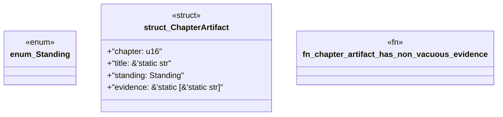

# `book/src/listings/appendix-I-appendix-i-canonical-chicago-tdd-consumer.rs`

Source SHA-256: `5de48cdfc63a83d26c8e8e539f3241fab93a8ada008606fdda5bf28e47b8f991`

## Dependencies

- None observed.

## Standing

- Structural parse: `ALIVE`
- Runtime behavior: `UNKNOWN`
