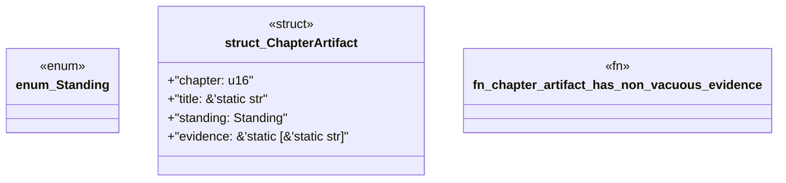

# `book/src/listings/appendix-N-appendix-n-pack-maturity-scoring-worksheet.rs`

Source SHA-256: `dd22198da1e308a855d26cb72675ff0480e6813d699f56f17d8f560a55f5952f`

## Dependencies

- None observed.

## Standing

- Structural parse: `ALIVE`
- Runtime behavior: `UNKNOWN`
