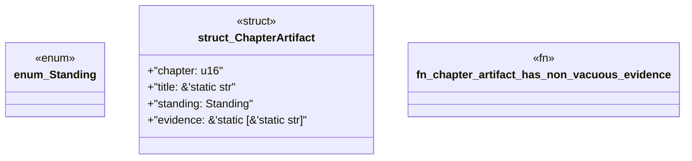

# `book/src/listings/appendix-O-appendix-o-level-five-definition-of-done.rs`

Source SHA-256: `89c61f69417647d1b25350a088d351ba5bfb8122837e386b249a92fab2bb2de6`

## Dependencies

- None observed.

## Standing

- Structural parse: `ALIVE`
- Runtime behavior: `UNKNOWN`
