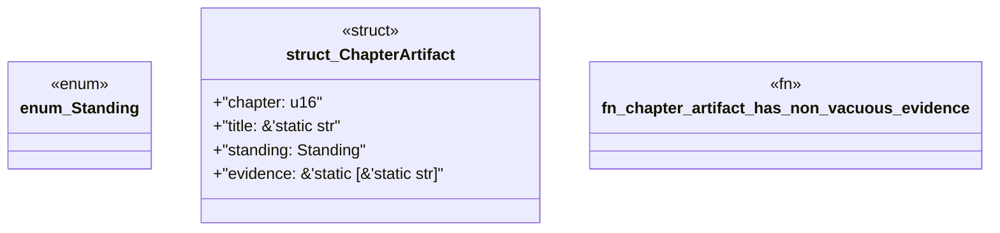

# `book/src/listings/appendix-R-appendix-r-tcps-corrective-divergence-ledger.rs`

Source SHA-256: `92414534745d01164ef92a63d06f0bede4567d7205c15ca951bb8b6b92e10648`

## Dependencies

- None observed.

## Standing

- Structural parse: `ALIVE`
- Runtime behavior: `UNKNOWN`
