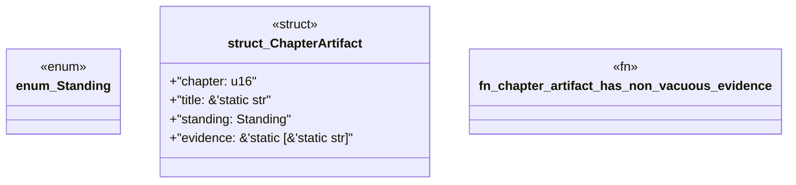

# `book/src/listings/appendix-S-appendix-s-ggen-failure-code-reference.rs`

Source SHA-256: `90b9a7f3cbd81f8edcc611fc7c2d092b23a1df9d2873305088382f1d87cc74a2`

## Dependencies

- None observed.

## Standing

- Structural parse: `ALIVE`
- Runtime behavior: `UNKNOWN`
